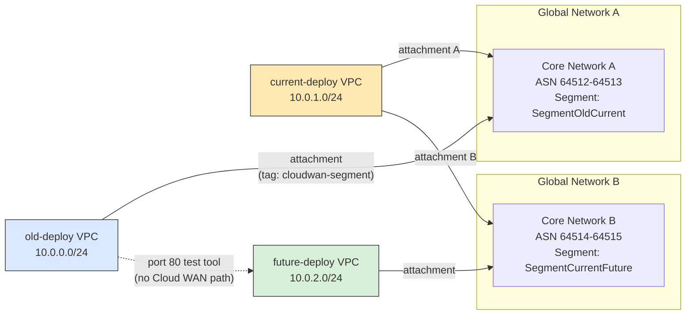

# dual-home-cloudwan-test

## Objective

Validate whether AWS Cloud WAN can host two independent core networks that each
connect a pair of VPCs standing in for successive deployment generations —
`old-deploy`, `current-deploy`, `future-deploy` — such that a failure or
configuration change in one core network can never affect the other.
`current-deploy` is the pivot: it reaches both its predecessor and its successor,
while `old-deploy` and `future-deploy` never reach each other directly.

Full context lives in [`docs/guidelines/vision.md`](docs/guidelines/vision.md)
(scope/objectives/non-goals), [`docs/guidelines/architecture.md`](docs/guidelines/architecture.md)
(technical decisions), and [`docs/guidelines/requirements.md`](docs/guidelines/requirements.md)
(FR/NFR/C catalog). This project follows the AI Unified Process (AIUP) methodology —
context written and agreed before infrastructure code — the same approach used in
[VETOnline](https://github.com/adolfobolivar/VETOnline). See
[`CLAUDE.md`](CLAUDE.md) for AI-assistant-specific guidelines and build/test
commands.

## Topology



Each VPC has two subnets: a workload subnet (security group scoped to TCP port 80,
peer-CIDR-only) and a Cloud WAN attachment subnet. VPC attachments auto-accept via a
tag-based attachment policy (`cloudwan-segment = <segment-name>`) — no manual
approval step. There is intentionally no route between `old-deploy` and
`future-deploy`: that gap is what this whole project exists to prove.

## Repository Layout

```
docs/guidelines/       vision, architecture, requirements, testing strategy
docs/use-cases/        UC-001..UC-003 full specs
.claude/skills/        project-local terraform-module skill
terraform/bootstrap/   remote-state backend (S3 + DynamoDB), applied once per env
terraform/environments/<env>/   root module — providers, input.yaml, the network module call
terraform/modules/network/      the VPCs/core networks/attachments/security groups
```

## Getting Started

```bash
# One-time per environment: create the remote-state backend
cd terraform/bootstrap/test
export AWS_ACCESS_KEY_ID=...       # matching terraform/environments/test/secrets.yaml
export AWS_SECRET_ACCESS_KEY=...
terraform init && terraform apply

# The environment itself
cd terraform/environments/test
export AWS_ACCESS_KEY_ID=...       # required every invocation — see Lessons Learned
export AWS_SECRET_ACCESS_KEY=...
terraform init -backend-config=backend.hcl
terraform plan
terraform apply
```

## Lessons Learned

Real AWS behavior that only surfaced once we actually applied this — kept here so
they aren't rediscovered the hard way twice. The underlying rules are also codified
in [`architecture.md`](docs/guidelines/architecture.md) and the
[`terraform-module` skill](.claude/skills/terraform-module/SKILL.md).

1. **A global network holds exactly one core network.** AWS's own docs describe a
   global network as containing "a single core network," and `CreateCoreNetwork`
   rejects a second one with `"Global Network ID is already associated with another
   core network."` Our first design put both core networks under one global
   network — wrong. Two independent core networks need **two independent global
   networks**, which turned out to reinforce the isolation goal rather than
   complicate it.

2. **ASN ranges can't be a single repeated value.** `asn-ranges: ["64512-64512"]`
   fails with `INVALID_ASN_RANGE` even though `64512 <= 64512` reads as valid — Cloud
   WAN needs a real (non-degenerate) range. Fix: reserve a 2-ASN range per core
   network (`[asn, asn+1]`), with the two core networks' ranges kept far enough
   apart that they can never overlap.

3. **`create_base_policy` auto-assigns an ASN before your real policy ever applies —
   deterministically the same one.** With `create_base_policy = true`, AWS
   auto-generates a base policy using the *full* default ASN range
   (64512-65534) and immediately assigns an edge an ASN from it. In testing, that
   auto-assigned ASN was **64512 for both core networks**, every time. If a
   narrower real policy's range doesn't include that already-assigned ASN,
   applying it fails with `INVALID_ASN_UPDATE: ASNs already in use cannot be
   removed`. Worse: if you "fix" this by widening the real policy to include
   64512, both core networks can end up sharing the same ASN — a direct violation
   of the isolation requirement. Fix: skip `create_base_policy` entirely and let
   your own policy be the first one ever applied to the core network, so there's
   no prior assignment to conflict with.

4. **Cloud WAN segment names are alphanumeric-only.** No hyphens, no underscores.
   `segment-old-current` is rejected; `SegmentOldCurrent` works.

5. **The Terraform S3 backend can't read `secrets.yaml`.** Terraform resolves a
   `backend "s3" {}` block before evaluating any locals or variables, so
   `AWS_ACCESS_KEY_ID`/`AWS_SECRET_ACCESS_KEY` must be exported as real environment
   variables for every `init`/`plan`/`apply` — the `provider "aws"` block's
   `secrets.yaml`-based credentials don't cover the backend itself.

6. **`Name` is the one tag `default_tags` can't cover.** The four mandated tags
   (`Environment`/`Project`/`Owner`/`ManagedBy`) come from the provider's
   `default_tags` block and should never be repeated per-resource — but `Name` is
   resource-specific by definition, so it's the one tag every resource needs its
   own `tags = { Name = "..." }` block for. Easy to forget precisely because the
   "don't tag individually" rule sounds like it should cover this too.

7. **Cloud WAN provisioning is slow.** Each core network policy attachment took
   ~4-5 minutes; each VPC attachment took another ~4 minutes. A full `apply` from
   scratch is a 15-20+ minute affair, not a bootstrap-style few-seconds operation —
   plan for it (and expect to run applies in the background with a completion
   check, not watch a terminal).


## Status

Core networking infrastructure (VPCs, both core networks, all four attachments,
security groups) is live and verified — all attachments `AVAILABLE`, ASNs confirmed
non-overlapping (64512 / 64514). Not yet built: the Fargate-based port-80
connectivity test tooling described in `architecture.md` §6.
