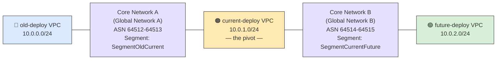

# dual-home-cloudwan-test

## Objective

Validate whether AWS Cloud WAN can host two independent core networks that each
connect a pair of VPCs standing in for successive deployment generations —
`old-deploy`, `current-deploy`, `future-deploy` — such that a failure or
configuration change in one core network can never affect the other.
`current-deploy` is the pivot: it reaches both its predecessor and its successor,
while `old-deploy` and `future-deploy` never reach each other directly.

## Topology

A single straight chain, left to right — `current-deploy` is the only VPC that
appears twice, once in each half:



- **Two separate chains, joined only at `current-deploy`.** Core Network A (its own
  Global Network, ASN range, segment) links `old-deploy` ↔ `current-deploy`. Core
  Network B (a *different* Global Network, ASN range, segment) links `current-deploy`
  ↔ `future-deploy`. Nothing is shared between the left half and the right half
  except the `current-deploy` VPC itself.
- **`old-deploy` and `future-deploy` are not connected, directly or indirectly** —
  there is no edge between them in this diagram on purpose. Proving that gap stays
  closed is the entire point of this project.
- Each VPC attaches to its core network automatically via a tag-based attachment
  policy (tag `cloudwan-segment`, matched to that core network's segment name) — no
  manual approval step.
- Each VPC has two subnets: a workload subnet (security group scoped to TCP port 80,
  peer-VPC-CIDR-only — never `0.0.0.0/0`) and a separate subnet dedicated to the
  Cloud WAN attachment's network interfaces.

## Results

Real output from the real AWS account this project targets — not a description of
what should happen, what actually happened.

### Connectivity test runs (`scripts/run-connectivity-check.sh`)

```
$ scripts/run-connectivity-check.sh old current          # UC-001
Listener private IP: 10.0.1.28
RESULT: PASS (old -> current, 10.0.1.28:80 reachable)

$ scripts/run-connectivity-check.sh current future        # UC-002
Listener private IP: 10.0.2.36
RESULT: PASS (current -> future, 10.0.2.36:80 reachable)

$ scripts/run-connectivity-check.sh old future             # isolation check
Listener private IP: 10.0.2.12
RESULT: FAIL (old -> future), container exit code 1
```

The third result is the point of the whole project: `old-deploy` and `future-deploy`
cannot reach each other, on purpose, because no core network and no route connects
them.

### Proof: `current-deploy` is attached to two different core networks

`current-deploy` is the only VPC with two attachments — one per peer. Same VPC
(`ResourceArn`), two different `CoreNetworkId` values, two different segments:

```
$ aws networkmanager get-vpc-attachment --attachment-id attachment-00df540b9164c8322 \
    --query 'VpcAttachment.Attachment.[AttachmentId,CoreNetworkId,SegmentName,State,ResourceArn]'
[
    "attachment-00df540b9164c8322",
    "core-network-0b98b97f70cb2825b",          <- Core Network A
    "SegmentOldCurrent",
    "AVAILABLE",
    "arn:aws:ec2:us-east-2:302294933419:vpc/vpc-04b1373f59ecc0d61"   <- current-deploy
]

$ aws networkmanager get-vpc-attachment --attachment-id attachment-0054b96b129d086e0 \
    --query 'VpcAttachment.Attachment.[AttachmentId,CoreNetworkId,SegmentName,State,ResourceArn]'
[
    "attachment-0054b96b129d086e0",
    "core-network-0eeb4e3556cc857ad",          <- Core Network B (different from above)
    "SegmentCurrentFuture",
    "AVAILABLE",
    "arn:aws:ec2:us-east-2:302294933419:vpc/vpc-04b1373f59ecc0d61"   <- same VPC as above
]
```

### Proof: VPC route tables actually point at the core networks

```
$ aws ec2 describe-route-tables --route-table-ids rtb-036a971b2c31020a7   # old-deploy-workload-rt
Routes:
  10.0.0.0/24  -> local
  10.0.1.0/24  -> CoreNetworkArn: .../core-network-0b98b97f70cb2825b   (Core Network A)
  (S3 prefix list) -> vpce-03872315272444c9d
# No route to 10.0.2.0/24 (future-deploy) anywhere in this table.

$ aws ec2 describe-route-tables --route-table-ids rtb-0fdb1ea6ab56337ac   # current-deploy-workload-rt
Routes:
  10.0.0.0/24  -> CoreNetworkArn: .../core-network-0b98b97f70cb2825b   (Core Network A)
  10.0.1.0/24  -> local
  10.0.2.0/24  -> CoreNetworkArn: .../core-network-0eeb4e3556cc857ad   (Core Network B, different)
  (S3 prefix list) -> vpce-065fc5473cd3f943b

$ aws ec2 describe-route-tables --route-table-ids rtb-01711203e8742c327   # future-deploy-workload-rt
Routes:
  10.0.1.0/24  -> CoreNetworkArn: .../core-network-0eeb4e3556cc857ad   (Core Network B)
  10.0.2.0/24  -> local
  (S3 prefix list) -> vpce-0e66520c09f489eee
# No route to 10.0.0.0/24 (old-deploy) anywhere in this table.
```

`current-deploy`'s route table is the only one with two `CoreNetworkArn` routes,
targeting two different core networks — everything else in this project (the
attachments, the segments, the ASNs, the global networks) exists to make these
three route tables look exactly like this.

## Status

All infrastructure is live and verified end-to-end, including a real connectivity
test run:

- Core networking (VPCs, both core networks, all four attachments, security
  groups, workload route tables): all attachments `AVAILABLE`, ASNs confirmed
  non-overlapping (64512 / 64514).
- VPC endpoints (ECR API/DKR, CloudWatch Logs, S3) in all three VPCs, private ECR
  repository, ECS Fargate cluster/task definition (`terraform/modules/connectivity_test/`).
- `scripts/run-connectivity-check.sh` run for all three cases:
  **`old → current`: PASS**, **`current → future`: PASS**, **`old → future`: FAIL**
  — the isolation boundary this whole project exists to prove holds.

## Lessons Learned

Real AWS behavior that only surfaced once we actually applied this — kept here so
they aren't rediscovered the hard way twice. The underlying rules are also codified
in [`architecture.md`](docs/guidelines/architecture.md) and the
[`terraform-module` skill](.claude/skills/terraform-module/SKILL.md).

1. **A global network holds exactly one core network.** AWS's own docs describe a
   global network as containing "a single core network," and `CreateCoreNetwork`
   rejects a second one with `"Global Network ID is already associated with another
   core network."` Our first design put both core networks under one global
   network — wrong. Two independent core networks need **two independent global
   networks**, which turned out to reinforce the isolation goal rather than
   complicate it.

2. **ASN ranges can't be a single repeated value.** `asn-ranges: ["64512-64512"]`
   fails with `INVALID_ASN_RANGE` even though `64512 <= 64512` reads as valid — Cloud
   WAN needs a real (non-degenerate) range. Fix: reserve a 2-ASN range per core
   network (`[asn, asn+1]`), with the two core networks' ranges kept far enough
   apart that they can never overlap.

3. **`create_base_policy` auto-assigns an ASN before your real policy ever applies —
   deterministically the same one.** With `create_base_policy = true`, AWS
   auto-generates a base policy using the *full* default ASN range
   (64512-65534) and immediately assigns an edge an ASN from it. In testing, that
   auto-assigned ASN was **64512 for both core networks**, every time. If a
   narrower real policy's range doesn't include that already-assigned ASN,
   applying it fails with `INVALID_ASN_UPDATE: ASNs already in use cannot be
   removed`. Worse: if you "fix" this by widening the real policy to include
   64512, both core networks can end up sharing the same ASN — a direct violation
   of the isolation requirement. Fix: skip `create_base_policy` entirely and let
   your own policy be the first one ever applied to the core network, so there's
   no prior assignment to conflict with.

4. **Cloud WAN segment names are alphanumeric-only.** No hyphens, no underscores.
   `segment-old-current` is rejected; `SegmentOldCurrent` works.

5. **The Terraform S3 backend can't read `secrets.yaml`.** Terraform resolves a
   `backend "s3" {}` block before evaluating any locals or variables, so
   `AWS_ACCESS_KEY_ID`/`AWS_SECRET_ACCESS_KEY` must be exported as real environment
   variables for every `init`/`plan`/`apply` — the `provider "aws"` block's
   `secrets.yaml`-based credentials don't cover the backend itself.

6. **`Name` is the one tag `default_tags` can't cover.** The four mandated tags
   (`Environment`/`Project`/`Owner`/`ManagedBy`) come from the provider's
   `default_tags` block and should never be repeated per-resource — but `Name` is
   resource-specific by definition, so it's the one tag every resource needs its
   own `tags = { Name = "..." }` block for. Easy to forget precisely because the
   "don't tag individually" rule sounds like it should cover this too.

7. **Cloud WAN provisioning is slow.** Each core network policy attachment took
   ~4-5 minutes; each VPC attachment took another ~4 minutes. A full `apply` from
   scratch is a 15-20+ minute affair, not a bootstrap-style few-seconds operation —
   plan for it (and expect to run applies in the background with a completion
   check, not watch a terminal).

8. **An `AVAILABLE` attachment doesn't mean traffic flows.** All four VPC
   attachments reached `AVAILABLE` well before any route table pointed at them —
   a VPC's subnets only route within their own VPC until a route table gets an
   explicit route to the peer CIDR via the core network's ARN
   (`aws_route`'s `core_network_arn`, not an ENI/gateway ID). Easy to miss
   because nothing in the attachment's own state signals it: the attachment
   looks completely healthy either way.

9. **ECR Public Gallery is unreachable from a fully private VPC, full stop.**
   `public.ecr.aws` only lives in us-east-1 with no regional VPC endpoint — no
   security group or route table fix makes it reachable from a private VPC
   elsewhere. The connectivity-test image has to live in a private ECR
   repository in this same region, pulled through regional `ecr.api`/`ecr.dkr`
   VPC interface endpoints instead.

10. **One security-group egress rule for "VPC endpoints" isn't enough — gateway
    endpoints and interface endpoints need different rule types.** A rule
    referencing the endpoint security group covers the interface endpoints
    (`ecr.api`, `ecr.dkr`, `logs` — they have real ENIs). It does nothing for the
    S3 gateway endpoint, which has no ENI or security group at all (pure
    route-table/prefix-list mechanism) — ECR stores image layers in S3, so
    without a *second*, prefix-list-based egress rule, the image pull fails at
    the layer-download step even though auth already succeeded. Both failure
    modes print the identical-looking `dial tcp <ip>:443: i/o timeout` — nothing
    about the error says "security group," it reads exactly like a routing
    problem.

## Lines of Code

Counted with `cloc` against the current working tree (blank lines and comments
excluded; `.terraform/`, provider lock files, `.tfstate`, and `secrets.yaml`
excluded — none of those are authored content).

| Area | Files | Lines of Code | Primary Languages |
| :--- | :-: | :-: | :--- |
| Terraform (`terraform/`) | 18 | 844 | HCL (831), YAML |
| Docs (`docs/`, `README.md`, `CLAUDE.md`) | 10 | 680 | Markdown (659), PlantUML |
| Connectivity tooling (`docker/`, `scripts/`) | 3 | 119 | Shell (76), Python (39), Dockerfile |
| Config (`.claude/`, `.mcp.json`) | 3 | 189 | Markdown (101), JSON |
| **Total** | **34** | **1,832** | |

Every line above was written by Claude Code (model: **Claude Sonnet 5**) across this project's sessions — there's
no separate human-authored portion to break out; that's the whole premise of following VETOnline's AIUP-experiment
approach here too.

## Project Summary (as of 2026-07-24)

| Metric | Value |
| :--- | :--- |
| Project Duration | 1 day (2026-07-24) |
| Pull Requests Delivered | 4 merged, 1 pending (this session's Fargate connectivity tooling) |
| Total Commits | 9 |
| Lines of Code Delivered | 1,832 |
| Code Changes (this session) | 4,751 lines added, 153 removed |
| Total Tokens (this session) | 5.8M (Sonnet 5: 99.1%, Opus 4.8: 0.3%, Haiku 4.5: 0.5%) |
| Estimated Development Cost | $72.38 (this session, per Claude Code's own usage accounting) |
| AI Subscription Utilization | 9% of weekly plan |

Cost/usage figures are Claude Code's own `/usage` reporting for the session that built this project, not an
external estimate.

## Repository Layout

```
docs/guidelines/                vision, architecture, requirements, testing strategy
docs/use-cases/                 UC-001..UC-003 full specs
.claude/skills/                 project-local terraform-module skill
terraform/bootstrap/            remote-state backend (S3 + DynamoDB), applied once per env
terraform/environments/<env>/   root module — providers, input.yaml, the module calls
terraform/modules/network/      VPCs, core networks, attachments, security groups, route tables, VPC endpoints
terraform/modules/connectivity_test/   ECR repo, ECS Fargate cluster + task definition, IAM
docker/connectivity-test/       the connectivity-test container image (Python stdlib only)
scripts/run-connectivity-check.sh      the on-demand port-80 test tool (UC-001/UC-002/UC-003)
```

## Getting Started

```bash
# One-time per environment: create the remote-state backend
cd terraform/bootstrap/test
export AWS_ACCESS_KEY_ID=...       # matching terraform/environments/test/secrets.yaml
export AWS_SECRET_ACCESS_KEY=...
terraform init && terraform apply

# The environment itself
cd terraform/environments/test
export AWS_ACCESS_KEY_ID=...       # required every invocation — see Lessons Learned
export AWS_SECRET_ACCESS_KEY=...
terraform init -backend-config=backend.hcl
terraform plan
terraform apply
```
